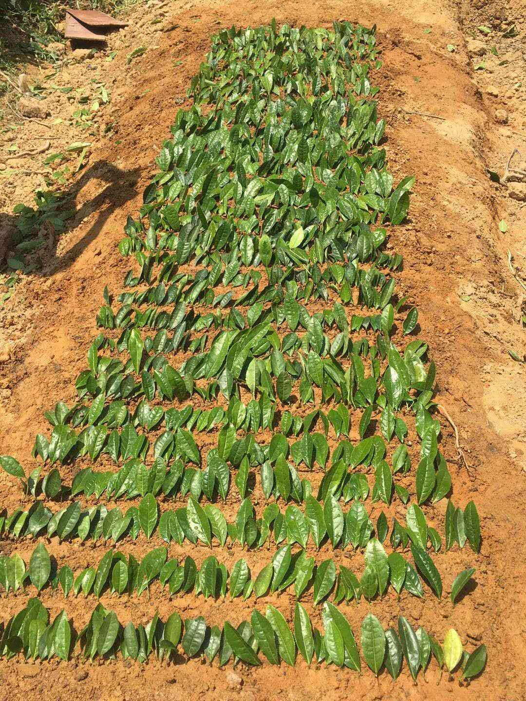

# A short introduction

This is my first web page. I am gonna to introduce my academic experience here. 

# Zhejiang University

I was an undergraduate student in [Zhejiang University](http://www.zju.edu.cn/). And I was major in Tea Science. What a interesting major! You may curious about this major and let's go ahead!

## What do students learn in this major

As all bachelors of Science, we learned advanced mathematics, physics, and chemistry in the first two years. Then we would learn cultivation and breeding of tea trees, processing and quality management of tea, and so on.

## The fantastic thing

The most fantastic thing is that we had a lot of agricultural practice, as pictures shows belowing.

### Tea garden

### Cuttage

### Hand-made tea

# Columbia University

Now, I am a MS student major in Biostatistics in [Columbia University](https://www.columbia.edu/). Due to the pandemic, we take courses online, but I am still acquainted with a lot of nice friends and kind teachers. Hope to meet them face-to-face next year!

